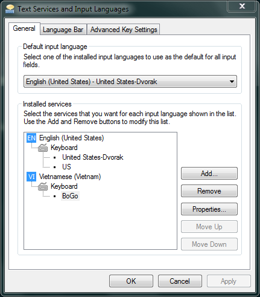

BoGo trên Windows
=================

Một số trang cần xem:

* Định hướng phát triển cho milestone 0.1.0

  https://github.com/BoGoEngine/bogo-win32/issues/milestones

* Trang tài liệu tra cứu

  https://github.com/BoGoEngine/bogo-win32/wiki/T%C3%A0i-li%E1%BB%87u-tra-c%E1%BB%A9u

* Trang Facts & Decisions

  https://github.com/BoGoEngine/bogo-win32/wiki/Facts-&-Decisions

## Hướng dẫn cài đặt

Cài dependency:

* [Python 2.7](http://www.python.org/getit/)
* [comtypes](http://sourceforge.net/projects/comtypes/)
* [py2exe](http://www.py2exe.org/)

Build file DLL:

    python2 setup.py py2exe

Đăng ký file DLL (cần quyền Administrator):

    regsvr32 dist\testComServer.dll

BoGo sẽ hiện ra trong danh sách các input method:

